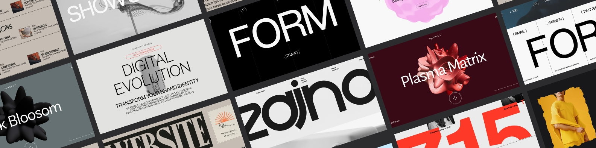

### 👋 Hello, I'm **Harshit Kumar Sahu a Creative and Functional Web Developer**

MERN | Three.js & Shaders | WebGL | Lenis & Locomotive.js | GSAP

  
  

## 🌐 About Me

Hi! I'm Harshit Kumar Sahu, a passionate computer science student with a love for web development and cutting-edge technologies. Whether it’s creating dynamic web pages, solving algorithmic challenges, or mentoring others, I enjoy every aspect of the tech journey.

💡 **Key Interests**:  
- Web Development (Frontend & Backend)  
- Creative UI/UX Design  
- Interactive 3D Web Graphics (Three.js)  

---

## 🚀 Technical Skills

- **Programming Languages**: Java, C, C++, Python, JavaScript, WebGl  
- **Web Development**: HTML, CSS, JavaScript, Bootstrap, Node.js, Express.js, MongoDB, React.js  
- **Libraries & Frameworks**: Locomotive.js, Lenis, GSAP, Three.js  
- **Tools & Technologies**: MySQL, APIs, RESTful Services  

---

## 🏆 Achievements

- 🥇 **1st Place**: Refresher Course on Web Development, LCIT Group of Institutions  
- 🥈 **2nd Place**: Technova Paper Presentation on Frontend Web Development  
- ⭐ **Mentorship**: Guided budding developers at DIV Foundation and CHOCS  
- 📜 **Certified**: Java & DSA and Full Stack Web Dev by Apna College 

---

## 💻 Projects 

1. **[AI.WORK](https://aiwork-8g44.onrender.com/)**  
   A dynamic platform where users can generate or upload images and share them with others, built with innovative AI tools and seamless web tech.
   **Tech Stack**: HTML, CSS, JavaScript, EJS, GSAP, MongoDB, Express.js, Node.js.  

2. **[form3js](https://form3js.vercel.app/)**  
   A creative platform using Three.js to craft and share immersive 3D visualizations with captivating water distortion effects on images, blending artistry and interactivity.
   **Tech Stack**: HTML, CSS, JavaScript, Three.js, GSAP, Lenis  

3. **[BlobMixture](https://blobmixer-three.vercel.app/)**  
   An interactive 3D tool that lets you manipulate blob geometry and materials in real time, bringing a whole new dimension to creative control.
   **Tech Stack**: HTML, CSS, JavaScript, GSAP, Three.js, Custom-Shader-Material  

---

🌟 Code is poetry, and every line builds a better tomorrow. 🌟

