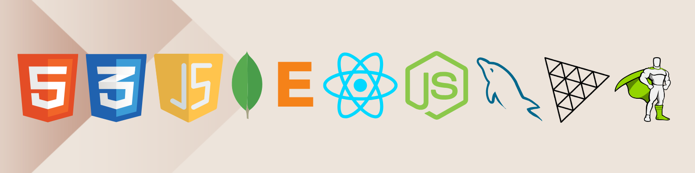
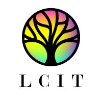

   

      

         
      

         
      

      

         

            <h1>Harshit Kumar Sahu</h1>
            
(He/Him)

         

         

            
            
LCIT Group of Institutions 

         

      

<h1>👋 Hello, I'm Harshit Kumar Sahu!</h1>

🎓 Final Year CSE Student | 💻 Aspiring Web Developer | 🌟 Tech Enthusiast  
  

---

## 🌐 About Me

Hi! I'm Harshit Kumar Sahu, a passionate computer science student with a love for web development and cutting-edge technologies. Whether it’s creating dynamic web pages, solving algorithmic challenges, or mentoring others, I enjoy every aspect of the tech journey.

💡 **Key Interests**:  
- Web Development (Frontend & Backend)  
- Progressive Web Apps (PWAs)  
- Creative UI/UX Design  
- Interactive 3D Web Graphics (Three.js)  
- Software + Hardware Integration  

---

## 🚀 Technical Skills

- **Programming Languages**: Java, C, C++, Python, JavaScript  
- **Web Development**: HTML, CSS, JavaScript, Bootstrap, Node.js, Express.js, MongoDB  
- **Libraries & Frameworks**: Locomotive.js, GSAP, Three.js  
- **Version Control**: Git & GitHub  
- **Tools & Technologies**: MySQL, APIs, RESTful Services  

---

## 🏆 Achievements

- 🥇 **1st Place**: Refresher Course on Web Development, LCIT Group of Institutions  
- 🥈 **2nd Place**: Technova Paper Presentation on Frontend Web Development  
- ⭐ **Mentorship**: Guided budding developers at DIV Foundation and CHOCS  
- 📜 **Certified**: Java & DSA by Apna College  

---

## 💻 Projects

1. **Modzy**  
   A dynamic shopping website featuring tailored sections, dark/light modes, and seamless UI.  
   **Tech Stack**: HTML, CSS, JavaScript, Bootstrap, Swiper.js  

2. **Planetarium**  
   A visually stunning 3D solar system using Three.js and GSAP.  
   **Tech Stack**: Three.js, GSAP  

3. **Quote Canvas**  
   A creative platform to design, edit, and share quotes with a live preview.  
   **Tech Stack**: HTML, CSS, JavaScript, Node.js, Express.js  

4. **Currency Converter**  
   A user-friendly currency converter utilizing APIs for live exchange rates.  
   **Tech Stack**: HTML, CSS, JavaScript  

5. **Twitter Clone** (Ongoing)  
   A basic Twitter replica with CRUD operations for tweets.  
   **Tech Stack**: HTML, CSS, JavaScript, Node.js, Express.js, MongoDB  

---

## 📫 Let's Connect!

  
  

---

🌟 **"Code is poetry, and every line builds a better tomorrow."**
